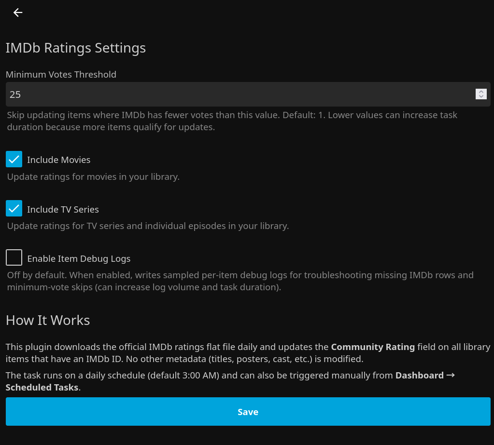

# Jellyfin IMDb Ratings

<p align="center">
  <a href="https://github.com/voc0der/jellyfin-imdb-rating-updater/releases/latest">
    
  </a>
  <a href="https://github.com/voc0der/jellyfin-imdb-rating-updater/tree/main/tests">
    
  </a>
  <a href="https://github.com/voc0der/jellyfin-imdb-rating-updater/issues">
    
  </a>
  <a href="LICENSE">
    
  </a>
  <a href="https://github.com/voc0der/jellyfin-imdb-rating-updater/blob/main/tests/Jellyfin.Plugin.ImdbRatings.Tests/Jellyfin.Plugin.ImdbRatings.Tests.csproj">
    
  </a>
</p>

A Jellyfin plugin that downloads the [IMDb ratings flat file](https://datasets.imdbws.com/title.ratings.tsv.gz) daily and updates `CommunityRating` on all library items with an IMDb ID. No other metadata is touched.

<p align="center">
  
</p>
<p align="center">
  <em>Configuration page inside the Jellyfin dashboard</em>
</p>

## Features

- Daily scheduled task (default 3 AM), also triggerable manually from Dashboard
- Downloads and caches the ~2MB compressed IMDb dataset with 23-hour cache
- Batch processing tuned to finish in well under a minute even for massive libraries
- Configurable minimum votes threshold (default: 1)
- Choose which library types to update (Movies, TV Series, or both)
- Progress reporting in the Jellyfin task UI

## Installation

### From Plugin Repository

1. In Jellyfin, go to **Dashboard > Plugins > Repositories**
2. Add: `https://raw.githubusercontent.com/voc0der/jellyfin-imdb-rating-updater/main/manifest.json`
3. Install **IMDb Ratings** from the catalog

### Manual

1. Download the latest release ZIP
2. Extract to your Jellyfin plugins directory
3. Restart Jellyfin

#### Building from source

```bash
dotnet build --configuration Release
```

## Configuration

Go to **Dashboard > Plugins > IMDb Ratings**:

- **Minimum Votes** — skip items with fewer IMDb votes than this (default: 1)
- **Include Movies** — update movie ratings
- **Include TV Series** — update series and episode ratings

## Star History

<p align="center">
  <a href="https://star-history.com/#voc0der/jellyfin-imdb-rating-updater&Date">
    <picture>
      <source media="(prefers-color-scheme: dark)" srcset="https://api.star-history.com/svg?repos=voc0der/jellyfin-imdb-rating-updater&type=Date&theme=dark" />
      <source media="(prefers-color-scheme: light)" srcset="https://api.star-history.com/svg?repos=voc0der/jellyfin-imdb-rating-updater&type=Date" />
      
    </picture>
  </a>
</p>
